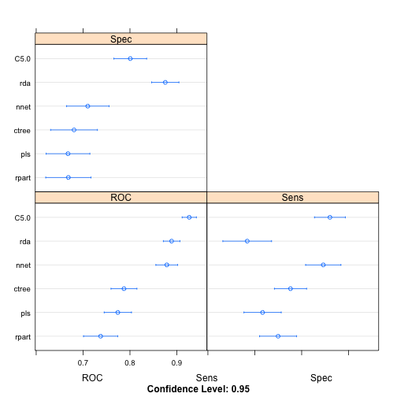
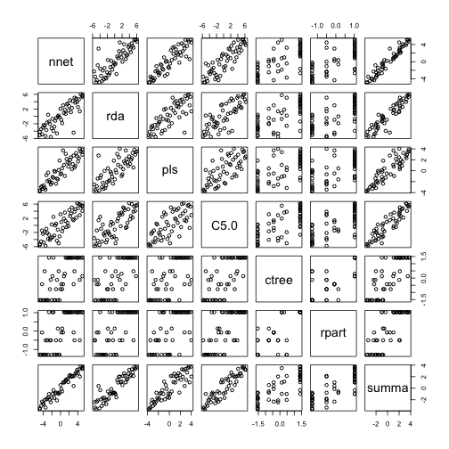

# Implement/test SUMMA+ library on Data Set 1 (Sonar)

## Preparations


```r
library(mlbench)

source('../r_summa.R')
```


```r
#set.seed(1024)
data(Sonar)
inTraining0 <- createDataPartition(Sonar$Class, p = .75, list = FALSE)
training <- Sonar[ inTraining0,]
testing  <- Sonar[-inTraining0,]
testingY <- Sonar[-inTraining0, ncol(Sonar)]
```


```r
s1 <- summa(c('nnet', 'rda', 'pls', 'C5.0', 'ctree'))
```


```r
s1 <- train(s1, Class~., training, update=F)
```

```
## Training algorithm : nnet with : 11 cores
```

```
## # weights:  993
## initial  value 105.503942 
## iter  10 value 16.977006
## iter  20 value 1.587046
## iter  30 value 0.877303
## iter  40 value 0.615275
## iter  50 value 0.524866
## iter  60 value 0.482130
## iter  70 value 0.461686
## iter  80 value 0.450353
## iter  90 value 0.444307
## iter 100 value 0.440317
## final  value 0.440317 
## stopped after 100 iterations
```

```
## Training algorithm : rda with : 11 cores
```

```
## Training algorithm : pls with : 11 cores
```

```
## Training algorithm : C5.0 with : 11 cores
```

```
## Training algorithm : ctree with : 11 cores
```


```r
s1 <- addmodel.summa(s1, c('rpart'))
s1 <- train(s1, Class~., training, update=F)
```

```
## Training algorithm : nnet with : 11 cores
```

```
## ... using cached result: nnet
```

```
## Training algorithm : rda with : 11 cores
```

```
## ... using cached result: rda
```

```
## Training algorithm : pls with : 11 cores
```

```
## ... using cached result: pls
```

```
## Training algorithm : C5.0 with : 11 cores
```

```
## ... using cached result: C5.0
```

```
## Training algorithm : ctree with : 11 cores
```

```
## ... using cached result: ctree
```

```
## Training algorithm : rpart with : 11 cores
```


```r
plot(s1)
```




```r
(s1 <- predict(s1, newdata=testing, alpha=1, Y=testingY))
```

```
##        nnet     rda     pls    C5.0    ctree    rpart   summa
## ROC  0.9414  0.9537  0.9074  0.9568  0.79938  0.76235  0.9660
## l1  -5.6039 -6.3681 -4.2952 -6.6054 -2.39645 -2.00343 -7.4901
## l2   0.2037  0.2315  0.1559  0.2401  0.08596  0.07134  0.2723
## rs  26.9387 26.9995 26.8023 27.0163 26.50846 26.43161 27.0703
```


```r
s2 <- predict(s1, testing, newmodellist = c('pls', 'ctree'), alpha=11, Y=testingY)
```


```r
print(s1)
```

```
##        nnet     rda     pls    C5.0    ctree    rpart   summa
## ROC  0.9414  0.9537  0.9074  0.9568  0.79938  0.76235  0.9660
## l1  -5.6039 -6.3681 -4.2952 -6.6054 -2.39645 -2.00343 -7.4901
## l2   0.2037  0.2315  0.1559  0.2401  0.08596  0.07134  0.2723
## rs  26.9387 26.9995 26.8023 27.0163 26.50846 26.43161 27.0703
```


```r
predict(s1, alpha=13)
```

```
##        nnet     rda     pls    C5.0    ctree    rpart   summa
## ROC  0.9414  0.9537  0.9074  0.9568  0.79938  0.76235  0.9799
## l1  -5.6039 -6.3681 -4.2952 -6.6054 -2.39645 -2.00343 -9.7896
## l2   0.2037  0.2315  0.1559  0.2401  0.08596  0.07134  0.3560
## rs  26.9387 26.9995 26.8023 27.0163 26.50846 26.43161 27.1694
```


```r
rocrank(s1$testproblist$svmRadial, testingY)
```

```
## Error in data.frame(prob = problist[[class1name]], truth = reference): arguments imply differing number of rows: 0, 51
```


```r
res <- cal_score(s1, view=T)
```



```
##         nnet    rda    pls   C5.0  ctree  rpart  summa
## nnet  1.0000 0.8456 0.8953 0.8548 0.7138 0.7006 0.9615
## rda   0.8456 1.0000 0.7800 0.7652 0.6684 0.6645 0.9171
## pls   0.8953 0.7800 1.0000 0.7015 0.6065 0.5978 0.8745
## C5.0  0.8548 0.7652 0.7015 1.0000 0.6739 0.7061 0.9100
## ctree 0.7138 0.6684 0.6065 0.6739 1.0000 0.8434 0.7683
## rpart 0.7006 0.6645 0.5978 0.7061 0.8434 1.0000 0.7791
## summa 0.9615 0.9171 0.8745 0.9100 0.7683 0.7791 1.0000
```


```r
s1$modellist
```

```
## [1] "nnet"  "rda"   "pls"   "C5.0"  "ctree" "rpart"
```

